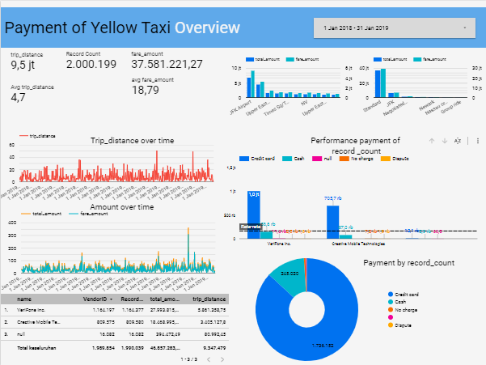
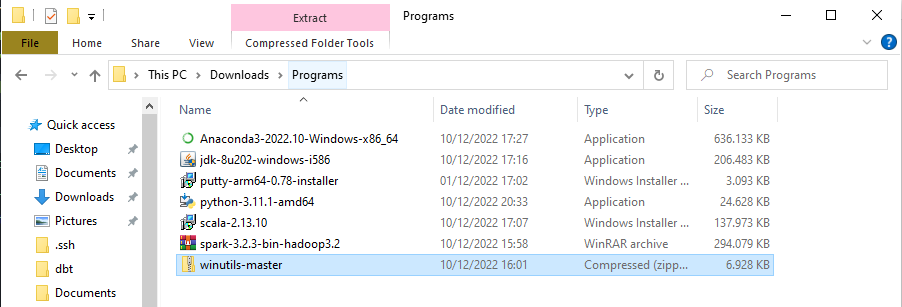
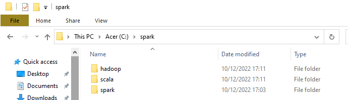
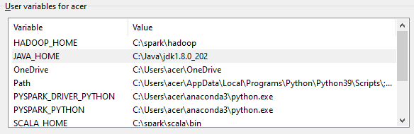
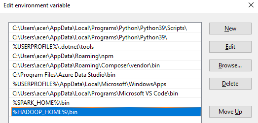
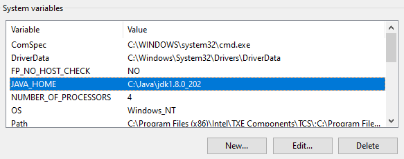
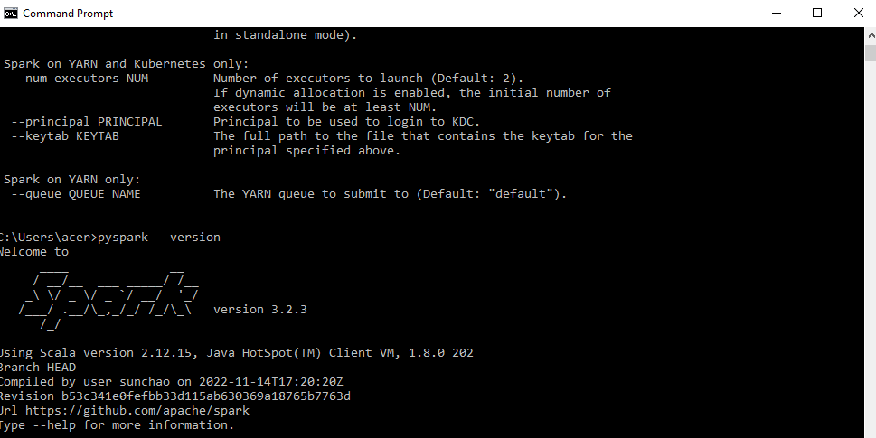

# Case 5 Data Fellowship 8 IYKRA

## Problems
Part 1 :

Create a dashboard with your own choice of tool with the yellow taxi trip records 2019 (dataset
pressumably is already there, or if not,

available to be downloaded here:
https://www.kaggle.com/datasets/microize/newyork-yellow-taxi-trip-data-2020-2019?resource=download 
or https://www1.nyc.gov/site/tlc/about/tlc-trip-record-data.page).

Put the dashboard url and the screenshot of the dashboard in the repo, with a little explanation about
the dashboard you made.

Part 2 :

Create a guide to install pyspark and put it in your repo. Print its version, screenshot it, and put the
screenshot in the repo.

## Data Visualization Result
Link : https://datastudio.google.com/reporting/2244835c-4499-490c-960c-5b23151c8146

This dashboard explains the achievement of data from yellow taxis in terms of payment type in January 2019. The total use of transactions amounts to around 2 million, with an amount of around 37 million. Vendor Verifone Inc. and creative mobile tech. predominately payments via credit, around 1 million user Verifone vendors use this type of credit payment. 

As a result, credit is more in demand by users than other types of payments. Other information, verifone inc. has more users and more amounts than other vendors. 

On January 1 at 00.12.56 it has a high amount value of around 300 and the farthest distance is on January 1 at 00.11.27 with a distance of 50, it is necessary to ascertain whether the distance and amount are of reasonable value?

## How to Install PySpark in Windows?
1. Firstly, download Python, choose based on the OS your computer version on the following link : https://www.python.org/downloads/. 

   Install the downloaded file, don't forget to choose "Add Python to environment variable" during the installation.

Download Java JDK, choose based on the OS your computer version on the following link : https://www.oracle.com/java/technologies/downloads/. Install the downloaded file

   In the windows search bar, search "Edit the system environment variables" and click it. 
   The System Properties window will appear and click "Environment Variables".

Download Apache Spark on this link : https://spark.apache.org/downloads.html, select the latest Spark release and "Pre-built for Apache Hadoop 3.2" for the package type.

Download Anaconda, choose based on the OS your computer version on the following link : https://www.anaconda.com/products/distribution. Install the downloaded file

Download Scala, choose based on the OS your computer version on the following link : https://www.scala-lang.org/download/2.13.10.html. Install the downloaded file

Download Hadoop file on the following link : https://github.com/steveloughran/winutils. Extract file and take the hadoop-2.7.1

The following files must be downloaded

Put the java file outside the program files, like the following * I've put it in the program files folder, but pyspark can't be read.

Several files, such as spark, scala, and hadoop, are combined into a single folder on Local Disk C: as follows, *with the folder name spark.

2. In the "User variables" section, click "New". 

Create variable "JAVA_HOME" and "Variable value" as "C:\Java\jdk1.8.0_202".

Create variable "HADOOP_HOME" and "Variable value" as "C:\spark\hadoop".

Create variable "PYSPARK_DRIVER_PYTHON" and "Variable value" as "C:\Users\{USER}\anaconda3\python.exe".

Create variable "PYSPARK_PYTHON" and "Variable value" as "C:\Users\{USER}\anaconda3\python.exe".

Create variable "SCALA_HOME" and "Variable value" as "C:\spark\scala\bin".

Create variable "SPARK_HOME" and "Variable value" as "C:\spark\spark\spark-3.2.3-bin-hadoop3.2".

in the user variable, click  "path", then add it
%SPARK_HOME%\bin and %HADOOP_HOME%\bin

3. In the "System variables" section, click "New". 

Create variable "JAVA_HOME" and "Variable value" as "C:\Java\jdk1.8.0_202"

4. You have completed steps to install PySpark on Windows, open Command Prompt and type "pyspark --version", you can see the spark version like this:

