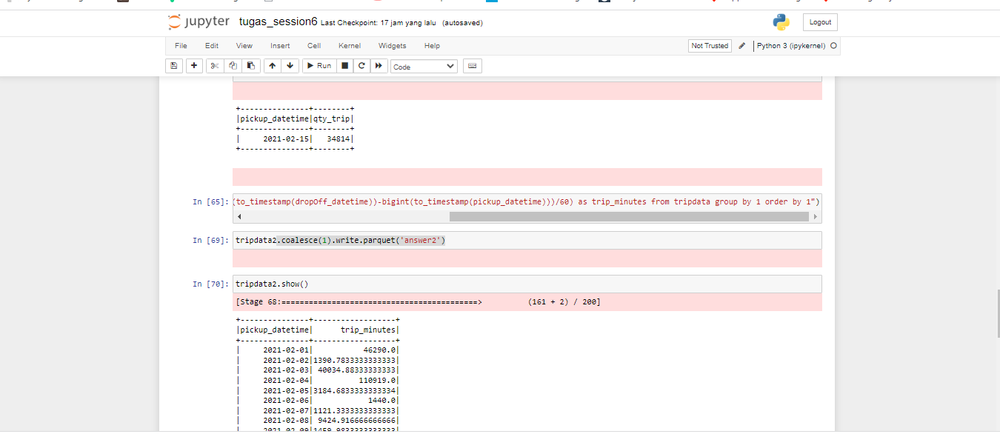
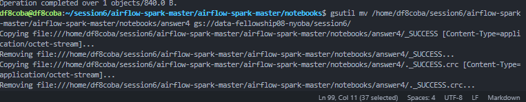
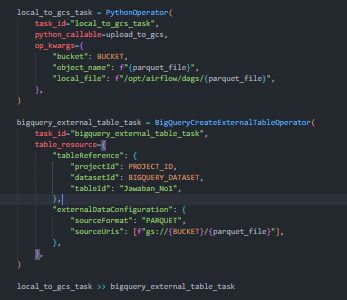
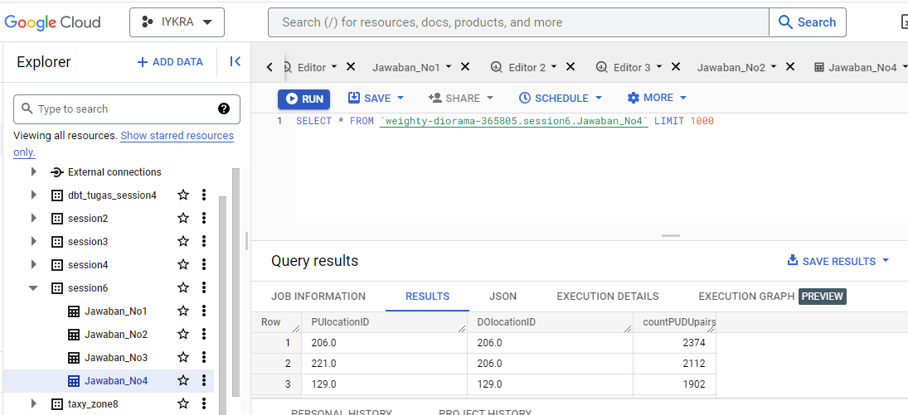

```python
import pyspark
pyspark.__file__
```


    '/usr/local/spark/python/pyspark/__init__.py'


```python
from pyspark.sql import SparkSession
```


```python
spark = SparkSession.builder \
    .master("local[*]") \
    .appName('test') \
    .getOrCreate()
```

    WARNING: An illegal reflective access operation has occurred
    WARNING: Illegal reflective access by org.apache.spark.unsafe.Platform (file:/usr/local/spark-3.1.2-bin-hadoop3.2/jars/spark-unsafe_2.12-3.1.2.jar) to constructor java.nio.DirectByteBuffer(long,int)
    WARNING: Please consider reporting this to the maintainers of org.apache.spark.unsafe.Platform
    WARNING: Use --illegal-access=warn to enable warnings of further illegal reflective access operations
    WARNING: All illegal access operations will be denied in a future release
    22/12/12 00:37:35 WARN NativeCodeLoader: Unable to load native-hadoop library for your platform... using builtin-java classes where applicable
    Using Spark's default log4j profile: org/apache/spark/log4j-defaults.properties
    Setting default log level to "WARN".
    To adjust logging level use sc.setLogLevel(newLevel). For SparkR, use setLogLevel(newLevel).


```python
spark
```


    <div>
        <p><b>SparkSession - in-memory</b></p>

<div>
    <p><b>SparkContext</b></p>

    <p><a href="http://ad1dbdd88916:4040">Spark UI</a></p>

    <dl>
      <dt>Version</dt>
        <dd><code>v3.1.2</code></dd>
      <dt>Master</dt>
        <dd><code>local[*]</code></dd>
      <dt>AppName</dt>
        <dd><code>test</code></dd>
    </dl>
</div>

    </div>


```python
!wget 'https://d37ci6vzurychx.cloudfront.net/trip-data/fhv_tripdata_2021-02.parquet'
```

    --2022-12-12 00:41:15--  https://d37ci6vzurychx.cloudfront.net/trip-data/fhv_tripdata_2021-02.parquet
    Resolving d37ci6vzurychx.cloudfront.net (d37ci6vzurychx.cloudfront.net)... 18.160.201.5, 18.160.201.50, 18.160.201.126, ...
    Connecting to d37ci6vzurychx.cloudfront.net (d37ci6vzurychx.cloudfront.net)|18.160.201.5|:443... connected.
    HTTP request sent, awaiting response... 200 OK
    Length: 10645466 (10M) [binary/octet-stream]
    Saving to: ‘fhv_tripdata_2021-02.parquet’
    
    fhv_tripdata_2021-0 100%[===================>]  10.15M  51.6MB/s    in 0.2s    
    
    2022-12-12 00:41:15 (51.6 MB/s) - ‘fhv_tripdata_2021-02.parquet’ saved [10645466/10645466]
    


```python
df = spark.read \
    .option("header", "true") \
    .parquet('fhv_tripdata_2021-02.parquet')
```

                                                                                    


```python
df.show(10)
```

                                                                                    

    +--------------------+-------------------+-------------------+------------+------------+-------+----------------------+
    |dispatching_base_num|    pickup_datetime|   dropOff_datetime|PUlocationID|DOlocationID|SR_Flag|Affiliated_base_number|
    +--------------------+-------------------+-------------------+------------+------------+-------+----------------------+
    |              B00013|2021-02-01 00:01:00|2021-02-01 01:33:00|        null|        null|   null|                B00014|
    |     B00021         |2021-02-01 00:55:40|2021-02-01 01:06:20|       173.0|        82.0|   null|       B00021         |
    |     B00021         |2021-02-01 00:14:03|2021-02-01 00:28:37|       173.0|        56.0|   null|       B00021         |
    |     B00021         |2021-02-01 00:27:48|2021-02-01 00:35:45|        82.0|       129.0|   null|       B00021         |
    |              B00037|2021-02-01 00:12:50|2021-02-01 00:26:38|        null|       225.0|   null|                B00037|
    |              B00037|2021-02-01 00:00:37|2021-02-01 00:09:35|        null|        61.0|   null|                B00037|
    |              B00112|2021-02-01 00:30:25|2021-02-01 00:57:23|        null|        26.0|   null|                B00112|
    |              B00149|2021-02-01 00:43:16|2021-02-01 01:03:16|        null|        72.0|   null|                B00149|
    |              B00221|2021-02-01 00:20:45|2021-02-01 00:21:15|        null|       244.0|   null|                B00221|
    |              B00225|2021-02-01 00:23:27|2021-02-01 00:55:46|        null|       169.0|   null|                B00225|
    +--------------------+-------------------+-------------------+------------+------------+-------+----------------------+
    only showing top 10 rows
    


```python
df.createOrReplaceTempView('tripdata')
```


```python
tripdata=spark.sql('SELECT * FROM tripdata limit 10')
```


```python
tripdata.show()
```

    +--------------------+-------------------+-------------------+------------+------------+-------+----------------------+
    |dispatching_base_num|    pickup_datetime|   dropOff_datetime|PUlocationID|DOlocationID|SR_Flag|Affiliated_base_number|
    +--------------------+-------------------+-------------------+------------+------------+-------+----------------------+
    |              B00013|2021-02-01 00:01:00|2021-02-01 01:33:00|        null|        null|   null|                B00014|
    |     B00021         |2021-02-01 00:55:40|2021-02-01 01:06:20|       173.0|        82.0|   null|       B00021         |
    |     B00021         |2021-02-01 00:14:03|2021-02-01 00:28:37|       173.0|        56.0|   null|       B00021         |
    |     B00021         |2021-02-01 00:27:48|2021-02-01 00:35:45|        82.0|       129.0|   null|       B00021         |
    |              B00037|2021-02-01 00:12:50|2021-02-01 00:26:38|        null|       225.0|   null|                B00037|
    |              B00037|2021-02-01 00:00:37|2021-02-01 00:09:35|        null|        61.0|   null|                B00037|
    |              B00112|2021-02-01 00:30:25|2021-02-01 00:57:23|        null|        26.0|   null|                B00112|
    |              B00149|2021-02-01 00:43:16|2021-02-01 01:03:16|        null|        72.0|   null|                B00149|
    |              B00221|2021-02-01 00:20:45|2021-02-01 00:21:15|        null|       244.0|   null|                B00221|
    |              B00225|2021-02-01 00:23:27|2021-02-01 00:55:46|        null|       169.0|   null|                B00225|
    +--------------------+-------------------+-------------------+------------+------------+-------+----------------------+
    

1. How many taxi trips were there on February 15?

```python
spark.sql("select cast(pickup_datetime as date), COUNT(*) as qty_trip from tripdata where extract(day from pickup_datetime) = 15 group by 1").show()
```

                                                                                    

    +---------------+--------+
    |pickup_datetime|qty_trip|
    +---------------+--------+
    |     2021-02-15|   34814|
    +---------------+--------+
    


                                                                                    
2. Find the longest trip for each day ?

```python
spark.sql("select cast(pickup_datetime as date), max((bigint(to_timestamp(dropOff_datetime))-bigint(to_timestamp(pickup_datetime)))/60) as trip_minutes from tripdata group by 1 order by 1").show()
```

    [Stage 25:===================================================>  (189 + 2) / 200]

    +---------------+------------------+
    |pickup_datetime|      trip_minutes|
    +---------------+------------------+
    |     2021-02-01|           46290.0|
    |     2021-02-02|1390.7833333333333|
    |     2021-02-03| 40034.88333333333|
    |     2021-02-04|          110919.0|
    |     2021-02-05|3184.6833333333334|
    |     2021-02-06|            1440.0|
    |     2021-02-07|1121.3333333333333|
    |     2021-02-08| 9424.916666666666|
    |     2021-02-09|1459.9833333333333|
    |     2021-02-10|3219.8166666666666|
    |     2021-02-11|2819.2166666666667|
    |     2021-02-12|            4344.0|
    |     2021-02-13| 8422.683333333332|
    |     2021-02-14|            1519.4|
    |     2021-02-15|          14670.15|
    |     2021-02-16|            4816.1|
    |     2021-02-17| 4284.783333333334|
    |     2021-02-18|1934.7666666666667|
    |     2021-02-19|           9012.15|
    |     2021-02-20|2615.5666666666666|
    +---------------+------------------+
    only showing top 20 rows
    


                                                                                    
3. Find Top 5 Most frequent `dispatching_base_num` ?

```python
spark.sql("select dispatching_base_num, count(*) as number_of_dispatching_base_num from tripdata group by 1 order by 2 desc limit 5").show()
```

    [Stage 27:=================================================>    (183 + 2) / 200]

    +--------------------+------------------------------+
    |dispatching_base_num|number_of_dispatching_base_num|
    +--------------------+------------------------------+
    |              B00856|                         35077|
    |              B01312|                         33089|
    |              B01145|                         31114|
    |              B02794|                         30397|
    |              B03016|                         29794|
    +--------------------+------------------------------+
    


                                                                                    
4. Find Top 5 Most common location pairs (PUlocationID and DOlocationID) ?

```python
spark.sql("select PUlocationID, DOlocationID, count(*) as countPUDUpairs from tripdata where PUlocationID is not null and DOlocationID is not null group by 1,2 order by 3 desc limit 5").show()
```

    [Stage 30:===============================================>      (175 + 2) / 200]

    +------------+------------+--------------+
    |PUlocationID|DOlocationID|countPUDUpairs|
    +------------+------------+--------------+
    |       206.0|       206.0|          2374|
    |       221.0|       206.0|          2112|
    |       129.0|       129.0|          1902|
    |         7.0|         7.0|          1829|
    |       179.0|       179.0|          1736|
    +------------+------------+--------------+
    


                                                                                    
5. Write all of the result to BigQuery table (additional - point plus) ? with dags ingestion to_local_gcs_ >> to_bigquery


#### Script save spark SQL in Jupyter(Python)


#### Move data to Bucket OR Wtih DAG


#### DAGs to BigQuery


#### In Snapshot Bigquery in session6 dataset

