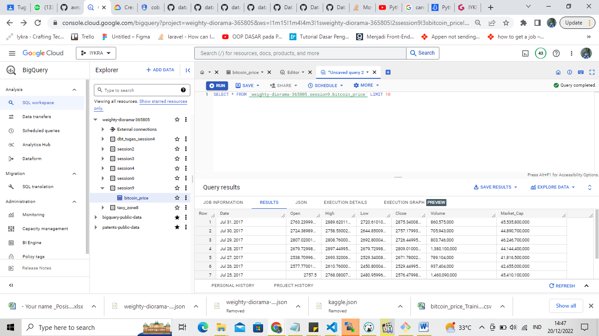

# Case 9 Data Fellowship 8 IYKRA

## Problems

Make an avro producer and avro consumer like the example in the code above has been shared but uses the bitcoin_price_Training dataset. 
If possible load to Big Query, will be a plus for this task.

## How to run the program?

1. Change keys.json with your own key, don't forget to change the file name to keys.json

4. Open Command Prompt in this directory, and type this command below to dockerize the Confluent Kafka:

```sh
docker compose up
```

5. Create a python virtual environment, activate it, and install the dependencies inside presqquites.txt, you can use this command:

```sh
pip install -r presequites.txt
```

6. To run the producer, type this command in the CMD:

```sh
python3 producer.py
```

7. To run the consumer, type this command in the CMD:

```sh
python3 consumer.py
```

8. If you failed to install the dependencies in step 5, you can use Windows Subsystem for Linux (WSL) as terminal in steps 5 through 7 instead of using Command Prompt.

## Result

<br>
